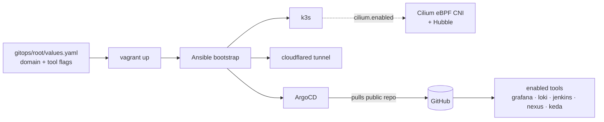

# k3s DevOps Lab


**Core stack** &nbsp;·&nbsp; *host → provisioning → cluster → GitOps → edge*


**DevOps stack** &nbsp;·&nbsp; *observability + CI/CD + artifacts + autoscaling + serverless*


A fully-automated, modular DevOps learning lab on one VMware VM. Toggle tools on/off in
`values.yaml`; ArgoCD installs or prunes them. Every tool is reachable at
`https://<tool>.<your-domain>` via a Cloudflare Tunnel — no port-forwarding, no public IP.

> [!IMPORTANT]
> **This repo is a template — every tool ships `enabled: false`.** Out of the box you
> get a bare cluster (k3s + ArgoCD + Cloudflare Tunnel) and nothing else. To use it:
> **fork → set `domain` + `repoURL` in [`values.yaml`](gitops/root/values.yaml) → flip on
> the tools you want → `vagrant up`.** Enabling Jenkins + Nexus? Run the one-time
> [Bootstrap CI/CD](docs/bootstrap.md) step afterward.

> [!NOTE]
> Optional **eBPF networking**: set `cilium.enabled` to swap Flannel + kube-proxy
> for [Cilium + Hubble](docs/cilium.md). Unlike the ArgoCD tool toggles, it's a
> provision-time flag (needs a fresh `vagrant up`).

📖 **Docs:** [Prerequisites](docs/prerequisites.md) · [Quick start](docs/quickstart.md) · [Configuration](docs/configuration.md) · [Bootstrap CI/CD](docs/bootstrap.md) · [Tools](docs/tools.md) · [KEDA](docs/keda.md) · [Knative](docs/knative.md) · [Cilium + Hubble](docs/cilium.md) · [Passwords](docs/passwords.md) · [Networking](docs/networking.md) · [VM sizing](docs/vm-sizing.md) · [Troubleshooting](docs/troubleshooting.md)

🧩 **Want to deploy your own app?** Copy the [`example/`](example/) app — manifests + ArgoCD setup, fully explained.



## Get your passwords

Username is `admin` for every tool:

```powershell
vagrant ssh -c "bash /vagrant/scripts/passwords.sh"
```

## Bootstrap CI/CD

If you enabled **Jenkins + Nexus**, run the one-time setup once both are Healthy. It
creates the registry pull/push secrets, lets Traefik route to ExternalName services, and
grants Jenkins least-privilege RBAC to deploy into your namespace:

```powershell
vagrant ssh -c "bash /vagrant/scripts/config.sh"
```

Full walkthrough and the pipeline it unlocks: **[Bootstrap CI/CD](docs/bootstrap.md)**.

## License

[Apache License 2.0](LICENSE) © 2026 Xeze-org.