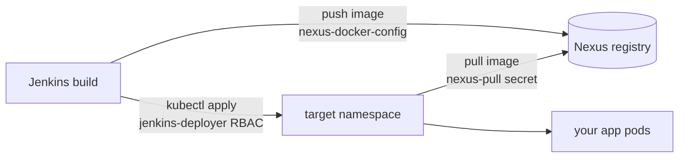

# Bootstrap CI/CD (`config.sh`)

Enabling `jenkins` and `nexus` in `values.yaml` installs the tools — but a CI/CD
pipeline also needs **glue** the Helm charts don't create: registry credentials,
Traefik permission to route to them, and RBAC so Jenkins is allowed to deploy.

`scripts/config.sh` wires all of that up in one interactive run. It's a **one-time,
post-deploy step** — run it once after the tools are healthy, not on every boot.

## When to run it

1. Set `jenkins.enabled` and `nexus.enabled` to `true` in
   [`gitops/root/values.yaml`](../gitops/root/values.yaml), `git push`.
2. Wait for ArgoCD to sync both apps to **Healthy** (~3 min). Check with:
   ```powershell
   vagrant ssh -c "bash /vagrant/scripts/status.sh"
   ```
3. Grab the Nexus admin password — you'll be prompted for it below:
   ```powershell
   vagrant ssh -c "bash /vagrant/scripts/passwords.sh"
   ```

> Running `config.sh` before Nexus is up will fail at the `helm repo add` step
> (the repo URL isn't reachable yet). Wait for Healthy first.

## How to run it

`config.sh` prompts for a password, so run it **interactively** (not via
`vagrant ssh -c`, which has no terminal):

```powershell
vagrant ssh
```
```bash
bash /vagrant/scripts/config.sh
```

It walks through three steps and prompts as it goes:

| Prompt              | Default            | Used for                                          |
| ------------------- | ------------------ | ------------------------------------------------- |
| Target Namespace    | `practice`         | Where your apps deploy + where the pull secret lands |
| Nexus Domain        | `nexus.xeze.org`   | The registry host (`nexus.<your-domain>`)         |
| Nexus Admin Password| *(hidden)*         | Authenticates the Helm repo + registry secrets    |

Re-running it is safe — every step is **idempotent** (secrets and RBAC are applied
with `--dry-run=client -o yaml | kubectl apply -f -`, so they're updated in place).

## What it configures

`config.sh` runs three scripts in order:

### 1. `secret.sh` — registry credentials

Adds the Nexus Helm repo, ensures your target namespace exists, then creates two
`docker-registry` secrets so Kubernetes can pull private images from Nexus:

- **`nexus-pull`** in your **target namespace** — the `imagePullSecret` your
  Deployments reference to pull built images.
- **`nexus-docker-config`** in the **`jenkins`** namespace — lets Jenkins
  authenticate to the registry when it **pushes** images during a build.

> These secrets live only in the cluster, not in Git. See
> [Docker registry](docker-registry.md) for how images flow through Nexus.

### 2. `traefik.sh` — allow ExternalName routing

Applies a `HelmChartConfig` that sets `allowExternalNameServices: true` on k3s's
bundled Traefik. Without it, Ingresses that point at an `ExternalName` Service are
silently dropped. This is what lets traffic reach services fronted that way.

### 3. `jenkins-rbac.sh` — least-privilege deploy permissions

Writes a `Role` + `RoleBinding` scoped to your target namespace and binds it to the
`default` ServiceAccount in the `jenkins` namespace. Jenkins can then create and
manage exactly what a deploy needs — Deployments/ReplicaSets, Services, Secrets,
ConfigMaps, Pods, Ingresses, and KEDA `HTTPScaledObjects` — **and nothing outside
that namespace**.

## The pipeline this unlocks



Jenkins builds an image and pushes it to Nexus (authenticated by
`nexus-docker-config`), then deploys manifests into your target namespace (permitted
by the `jenkins-deployer` Role). When the pods start, kubelet pulls the image back
from Nexus using the `nexus-pull` secret.

## Troubleshooting

| Symptom                                   | Cause / fix                                                        |
| ----------------------------------------- | ------------------------------------------------------------------ |
| `helm repo add` fails / times out         | Nexus isn't Healthy yet, or the Nexus domain prompt was wrong.     |
| `ErrImagePull` / `401` on your app pods   | `nexus-pull` missing from the namespace, or wrong password — re-run `config.sh`. |
| Jenkins deploy fails with `forbidden`     | Deploy targeted a different namespace than the RBAC — re-run and match the namespace. |
| Ingress to an ExternalName service 404s   | `traefik.sh` step didn't apply — re-run `config.sh`.               |

→ See also: [Configuration](configuration.md) · [Docker registry](docker-registry.md) · [Passwords](passwords.md) · [Troubleshooting](troubleshooting.md)
