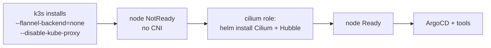

# Cilium (eBPF) + Hubble

[Cilium](https://cilium.io) replaces K3s's default networking with an
**eBPF**-based datapath: pod networking, Service routing, and NetworkPolicy all
run as sandboxed programs inside the Linux kernel instead of as userspace
iptables rules. [Hubble](https://docs.cilium.io/en/stable/observability/hubble/)
sits on top and gives a live map of every flow in the cluster.

> [!IMPORTANT]
> `cilium` is **not** a live ArgoCD toggle. It's a **provision-time** flag read
> by the Vagrantfile + Ansible at first boot — because Cilium *is* the CNI, and
> you can't hot-swap the CNI under a running node. Changing it requires a clean
> `vagrant destroy && vagrant up`.

## Enable / disable

```yaml
# gitops/root/values.yaml
cilium:
  enabled: true     # false = stock K3s (Flannel + kube-proxy)
```

| Value   | Pod networking | Service routing        | NetworkPolicy | Observability |
| ------- | -------------- | ---------------------- | ------------- | ------------- |
| `false` | Flannel (VXLAN) | kube-proxy (iptables) | none          | none          |
| `true`  | Cilium (eBPF)  | **Cilium eBPF** (kube-proxy replaced) | enforced | **Hubble**    |

## How it boots (the ordering that matters)



The `cilium` Ansible role runs **between `k3s` and `argocd`** (`playbook.yml`).
Cilium's agent uses host networking, so it can start on the NotReady node and
bootstrap the very network everything else needs. Traefik, servicelb, and
cloudflared are unaffected — they ride on top of whichever CNI is active.

## What gets installed

Cilium `1.19.5` via Helm into `kube-system`, with full kube-proxy replacement:

- `kubeProxyReplacement=true`, `socketLB.enabled=true`
- `k8sServiceHost=127.0.0.1` / `k8sServicePort=6443` — **required** without
  kube-proxy (no in-cluster `kubernetes` ClusterIP exists yet to bootstrap from);
  `127.0.0.1` is correct on this single node and dodges the multi-NIC trap.
- `cni.exclusive=false` — K3s-specific (don't wipe other CNI config).
- `ipam.mode=kubernetes`, `operator.replicas=1` (single node).
- Hubble + Hubble Relay + Hubble UI enabled.

Pin lives in `ansible/roles/cilium/defaults/main.yml`.

## See the eBPF datapath

```bash
vagrant ssh
# kube-proxy replacement active?
sudo k3s kubectl -n kube-system exec ds/cilium -- cilium status | grep KubeProxyReplacement   # -> True
# the iptables Service chains are gone:
sudo iptables -t nat -L KUBE-SERVICES 2>&1 | head
```

## Hubble UI (the live flow map)

Not exposed publicly — Hubble UI has no auth and reveals full topology, which
cuts against the lab's "no inbound holes" stance ([Networking](networking.md)).
Reach it on demand:

```bash
sudo k3s kubectl port-forward -n kube-system svc/hubble-ui 12000:80
# open http://localhost:12000
```

## Caveat: switching CNIs needs a rebuild

The `k3s` role only installs K3s `when` the binary is absent, so flipping
`cilium.enabled` on an **already-provisioned** VM won't re-apply the K3s flags —
Cilium would then try to install over Flannel and conflict. Always
`vagrant destroy && vagrant up` to switch.

→ See also: [Networking](networking.md) · [VM sizing](vm-sizing.md) · [Tools & toggling](tools.md)
