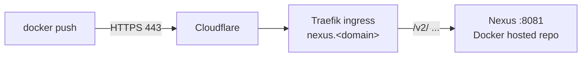

# Docker registry (via Nexus)

Nexus doubles as the container registry, so **Harbor stays off** (`harbor.enabled: false`)
— one less heavy tool. Images live at `nexus.<domain>/<repo>/<image>:<tag>`:

```powershell
docker login nexus.xeze.org              # Nexus admin creds (see Passwords)
docker tag myapp nexus.xeze.org/xeze/myapp:latest
docker push nexus.xeze.org/xeze/myapp:latest
```

Auth is required — anonymous push/pull is **off**. A logged-out push returns `401` and the
upload is refused.

## How it's wired



- Docker's registry API lives under `/v2/`; Traefik forwards it over the same
  `nexus.<domain>` ingress on **443**. No extra port is exposed.
- That's why the chart's `nexus.docker.enabled` stays **`false`** in
  `gitops/root/templates/nexus.yaml` — that flag only provisions a *separate* connector
  Service (the classic `:8082`-style port), which this single-ingress setup doesn't use.
- Docker refuses plaintext remotes, so this only works because Cloudflare/Traefik
  terminate TLS in front of Nexus. No `--insecure-registry` needed.

## ⚠️ This config is NOT in Git

The Docker **hosted repo**, its HTTP connector, and every pushed image live only in
Nexus's database on its PersistentVolume — **not** in this repo. Consequences:

- ArgoCD `selfHeal` will **not** recreate them. The manifests manage the Nexus *install*,
  not its *content*.
- Delete the `nexus` PVC (or re-provision Nexus) and the repo definition **and all
  images are gone** — nothing in Git restores them.

If you ever rebuild Nexus, recreate the repo manually (UI → **Settings → Repositories →
Create repository → `docker (hosted)`**):

| Setting              | Value                                                    |
| -------------------- | -------------------------------------------------------- |
| Name                 | `xeze` (becomes the path in the image name)              |
| HTTP / HTTPS connector | leave **unticked** — served on the main `:8081` port   |
| Allow anonymous pull | **off**                                                  |

Then Security → **Anonymous Access → disabled**, and grant push to a role/user.

## Pulling into k3s

Pulls from a browser/CLI just need `docker login`. For **k3s to pull** a private image in a
Deployment, containerd needs credentials — either an `imagePullSecret` on the workload:

```bash
kubectl create secret docker-registry nexus-pull \
  --docker-server=nexus.xeze.org --docker-username=admin --docker-password='<pass>'
```

…or a host-level `/etc/rancher/k3s/registries.yaml` entry. A missing secret shows up as
`ErrImagePull` / `401 Unauthorized` on the pod, not a registry-side error.

→ See also: [Tools & toggling](tools.md) · [Passwords](passwords.md) · [Troubleshooting](troubleshooting.md)
