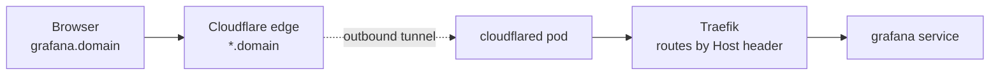

# How requests reach a tool

One wildcard `*.<domain>` covers every tool. The Cloudflare Tunnel is **outbound-only** —
no port-forwarding, no public IP, no inbound firewall holes.



- **TLS terminates at Cloudflare's edge.** In-cluster traffic to Traefik is plain HTTP, so
  Ingress objects don't carry a `tls:` block.
- **Traefik is the ingress controller** (k3s built-in). Ingresses use
  `ingressClassName: traefik` and route by `Host` header.
- The Cloudflare role creates a tunnel named `k3-kube`; re-runs reuse the in-cluster
  credentials. `scripts/clean-cf.sh` removes the tunnel + wildcard DNS.

## The CNI: Flannel vs Cilium (eBPF)

The `cilium.enabled` flag in `gitops/root/values.yaml` is a **provision-time**
switch (read by the Vagrantfile + Ansible at first boot, *not* reconciled by
ArgoCD). Changing it requires a full `vagrant destroy && vagrant up` — you cannot
hot-swap a CNI on a live node.

- **`false`** — stock K3s: Flannel (VXLAN overlay) for pod networking, kube-proxy
  (iptables) for Service routing, no NetworkPolicy enforcement.
- **`true`** — K3s installs with `--flannel-backend=none --disable-network-policy
  --disable-kube-proxy`, and the `cilium` Ansible role installs **Cilium** (eBPF)
  as the CNI with **full kube-proxy replacement** plus **Hubble**. Service routing
  moves from iptables `KUBE-*` chains into eBPF maps; NetworkPolicy is enforced.
  Traefik, servicelb, and cloudflared are unaffected — they ride on top of the CNI.

### Seeing the eBPF datapath
```bash
# kube-proxy replacement active?
sudo k3s kubectl -n kube-system exec ds/cilium -- cilium status | grep KubeProxyReplacement
# the iptables Service chains are gone:
sudo iptables -t nat -L KUBE-SERVICES 2>&1 | head
```

### Hubble UI (the live flow map)
Not exposed publicly (no auth, reveals full topology). Reach it on demand:
```bash
sudo k3s kubectl port-forward -n kube-system svc/hubble-ui 12000:80
# then open http://localhost:12000
```
