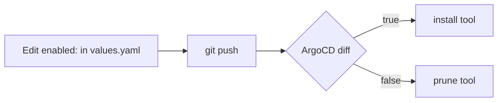

# Tools & toggling

Enable only what you need in `gitops/root/values.yaml`. ArgoCD installs enabled tools and
prunes disabled ones.

| Flag         | Tool                        | URL                      |
| ------------ | --------------------------- | ------------------------ |
| (always on)  | ArgoCD                      | `argocd.<domain>`        |
| `monitoring` | Prometheus + Grafana        | `grafana.<domain>`       |
| `loki`       | Loki (logs, via Grafana)    | — (no UI)                |
| `jenkins`    | Jenkins CI                  | `jenkins.<domain>`       |
| `nexus`      | Nexus Repository Manager    | `nexus.<domain>`         |
| `harbor`     | Harbor registry (optional)  | `registry.<domain>`      |
| `keda`       | KEDA autoscaler + Cron demo | — (no UI) — [docs](keda.md) |
| `kedaHttp`   | KEDA HTTP Add-on (scale-to-zero for web apps; needs `keda`) | — — [docs](keda.md#http-add-on--scale-web-apps-to-zero-cloud-run-style) |
| `knative`    | Knative Serving + Kourier (self-hosted Cloud Run) | — — [docs](knative.md) |

Nexus also serves as the Docker registry, so Harbor is usually left off — see
[Docker registry](docker-registry.md).

## Provision-time flag: `cilium`

`cilium` is **not** an ArgoCD-reconciled tool — it's the cluster CNI, read by the
Vagrantfile + Ansible at first boot. `true` swaps Flannel + kube-proxy for Cilium
(eBPF) + Hubble. You can't hot-swap a CNI, so changing it needs a full
`vagrant destroy && vagrant up`, not a `git push`. See [Cilium + Hubble](cilium.md).

## How toggling works



Edit a flag, `git push`, and ArgoCD reconciles within ~3 min. If you enable/disable a
**heavy** tool (Jenkins/Nexus), run `vagrant reload` so the VM resizes. To force ArgoCD
immediately:

```powershell
vagrant ssh -c "bash /vagrant/scripts/sync.sh"
```

→ See also: [VM sizing](vm-sizing.md) · [Passwords](passwords.md) · [Docker registry](docker-registry.md)
