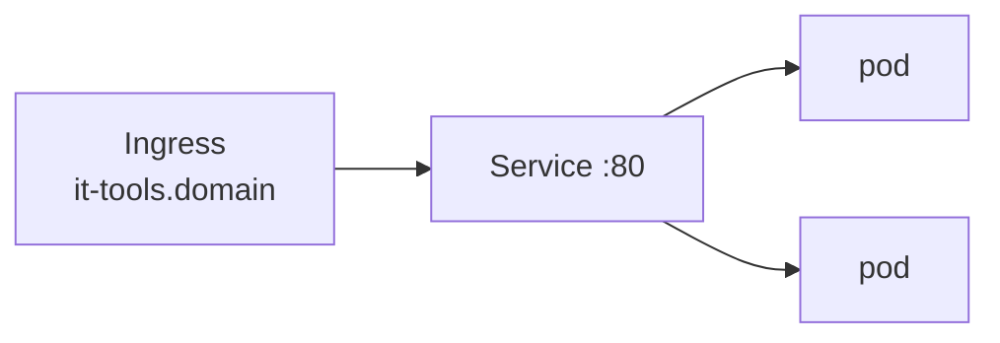

# Example app — deploy your own app

A complete, minimal app you can copy. It shows the three building blocks every app needs
and the two ways to deploy them on this lab. The app is
[it-tools](https://github.com/CorentinTh/it-tools) (a handy dev-tools web page).

```
it-tools/
  deployment.yaml   # the pods (2 replicas of the it-tools image)
  service.yaml      # stable address in front of the pods
  ingress.yaml      # routes it-tools.<your-domain> -> the service via Traefik
  kustomization.yaml# bundles the three + sets the namespace
application.yaml    # ArgoCD Application to manage it via GitOps (optional)
```



## Before you deploy

Edit `it-tools/ingress.yaml` and replace `example.com` with **your** domain:

```yaml
- host: it-tools.example.com   # -> it-tools.yourdomain.com
```

## Option A — deploy it now (kubectl, no GitOps)

Run inside the VM (`vagrant ssh`):

```bash
sudo k3s kubectl --kubeconfig=/etc/rancher/k3s/k3s.yaml apply -k /vagrant/example/it-tools
```

Open `https://it-tools.<your-domain>`. To remove it: same command with `delete` instead
of `apply`.

## Option B — let ArgoCD manage it (GitOps)

This is how the real tools work. Edit `application.yaml`, set `repoURL` to your fork, then
apply it once:

```bash
sudo k3s kubectl --kubeconfig=/etc/rancher/k3s/k3s.yaml apply -f /vagrant/example/application.yaml
```

From now on, edit the manifests, `git push`, and ArgoCD reconciles — no `kubectl` needed.

## The two rules that trip people up

1. **`ingressClassName: traefik`** — k3s uses Traefik, never `nginx`. An `nginx` class is
   ignored and you get a 404.
2. **No `tls:` block** — Cloudflare terminates TLS at the edge, so the Ingress stays plain
   HTTP. See [../docs/networking.md](../docs/networking.md).

→ To package a *Helm chart* instead of raw manifests, see
[../docs/configuration.md](../docs/configuration.md) ("Adding a new tool").
